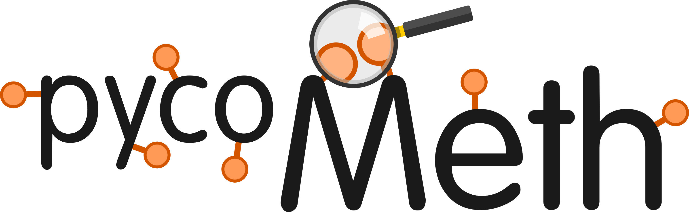
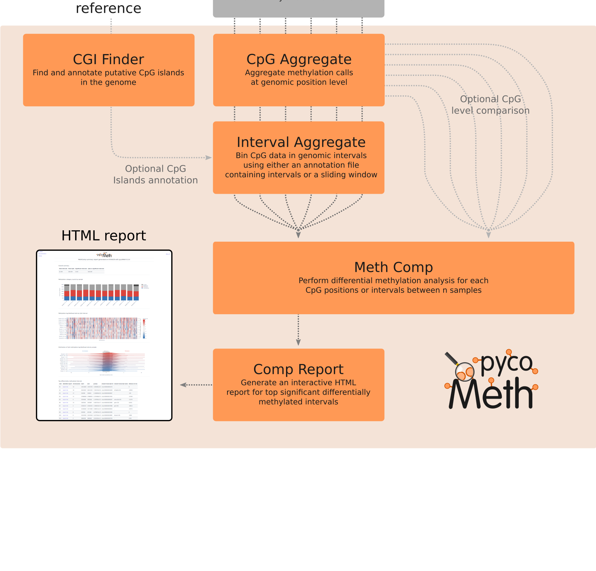

<!--  -->

---

**Full documentation is available at https://a-slide.github.io/pycoMeth/**

---

**Python package for nanopore DNA methylation analysis downstream to Nanopolish**

`pycoMeth` can be used for further analysis starting from the output files generated by [`Nanopolish call-methylation`](https://github.com/jts/nanopolish). The package contains tools to **summarize the methylation data at CpG or CpG island resolution** .`pycoMeth` also includes a simple method for **differential methylation analysis** across multiple samples.

---

### pycoMeth workflow

### pycoMeth example output IGV rendering

### Authors

* Adrien Leger - aleg {at} ebi.ac.uk
