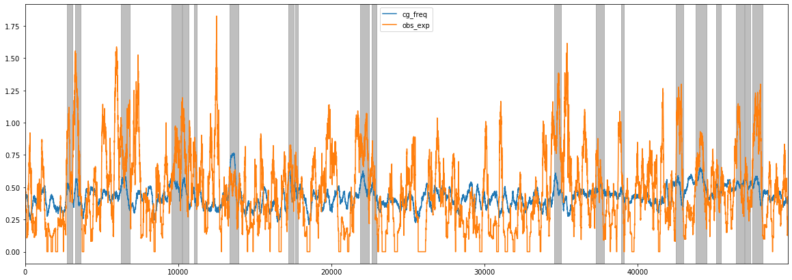

# CGI_Finder usage

**Simple method to find putative CpG islands in DNA sequences by using a sliding window and merging overlapping windows satisfying the CpG island definition. Results can be saved in bed and tsv format.**

## Example usage

* [Python API usage](https://a-slide.github.io/pycoMeth/CGI_Finder/API_usage/)
* [Shell CLI usage](https://a-slide.github.io/pycoMeth/CGI_Finder/CLI_usage/)

## Input file

### Reference FASTA file

FASTA reference file containing sequences in which CpG islands needs to be found.

## Output files

### Tabulated TSV file

This tabulated file contains the following fields for each CpG island found:

* chromosome / start / end : Genomic coordinates
* length: Length of the interval
* num_CpG: Number of CpGs found
* CG_freq: G+C nucleotide frequency
* obs_exp_freq: Observed versus expected CpG frequency

### BED file

Minimal standard genomic [BED3](https://genome.ucsc.edu/FAQ/FAQformat.html#format1) format listing the coordinates of putative CpG islands.

The picture below shows the putative CpG islands found (grey boxes) in an example sequence, overlaid with C+G frequency and observed/expected CpG frequency

