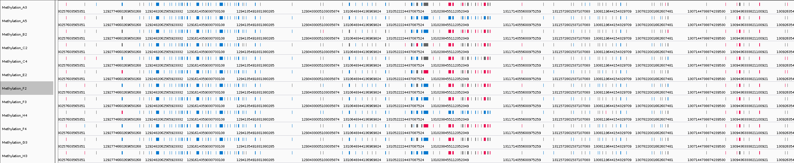

# Aggregate usage

## User interface

`pycoMeth Aggregate` was designed to be used either through a python Application programming interface (API) for Jupyter notebook or a command line interface (CLI).

### Jupyter API

* [pycoMeth API usage notebook](https://a-slide.github.io/pycoMeth/Aggregate/API_usage/)

### Shell CLI

* [pycoMeth CLI usage notebook](https://a-slide.github.io/pycoMeth/Aggregate/CLI_usage/)

## Output format

Aggregate can generates 2 files, a standard BED file and a tabulated file containing extra information

### Tabulated TSV file

This tabulated file contains the following fields:

* chrom / start / end / strand: Genomic coordinates of the motif or group of motifs in case split_group was not selected.
* methylated_reads / unmethylated_reads / ambiguous_reads: Number of reads at a given genomic location with a higher likelyhood of being methylated or unmethylated or with an ambiguous methylation call.
* sequence: -5 to +5 sequence of the motif or group of motifs in case split_group was not selected.
* num_motifs: Number of motif found in the group.
* median_llr: Median of log likelihood ratios for all read mapped
* llr_list: List of raw llr values

### BED file

Standard genomic BED6 (https://genome.ucsc.edu/FAQ/FAQformat.html#format1). The score correspond to the methylation frequency multiplied by 1000. The file is sorted by coordinates and can be rendered with a genome browser such as IGV

The sites are color-coded as follow:

* Red: Median log likelyhood ratio >= 2 (more methylated)
* Blue: Median log likelyhood ratio <= -2 (more unmethylated)
* Grey: Median log likelyhood ration between -2 and 2 (ambiguous methylation status)

Here is an example of multiple methylation bed files rendered with IGV

