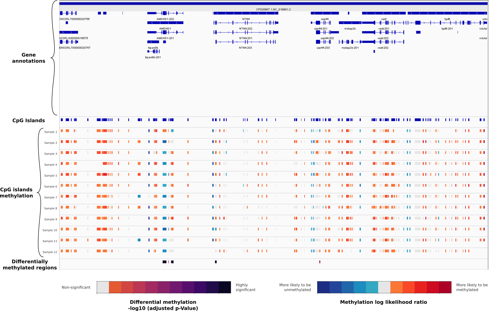

# Meth_Comp usage

**Compare methylation values for each CpG positions (`pycoMeth CpG_Aggregate`) or intervals (`pycoMeth Interval_Aggregate`) between n samples and perform a statistical test to evaluate if the positions are significantly different. For 2 samples a Mann_Withney test is performed otherwise multiples samples are compared with a Kruskal Wallis test. pValues are adjusted for multiple tests using the Benjamini & Hochberg procedure for controlling the false discovery rate.**

## Example usage

* [Python API usage](https://a-slide.github.io/pycoMeth/Meth_Comp/API_usage/)
* [Shell CLI usage](https://a-slide.github.io/pycoMeth/Meth_Comp/CLI_usage/)

## Input files

### pycoMeth CpG_Aggregate or Interval_Aggregate output file

A list of `pycoMeth CpG_Aggregate` or `pycoMeth Interval_Aggregate` **tsv** output files corresponding to different samples.

### Reference FASTA file

FASTA reference file used for read alignment and Nanopolish. This file is required and used to sort the CpG sites by coordinates.

## Output format

Meth_Comp can generates 2 files, a standard BED file and a tabulated file containing extra information.

### Tabulated TSV file

This tabulated file contains the following fields:

* chromosome / start / end / strand: Genomic coordinates of the motif or group of motifs in case split_group was not selected.
* n_samples: Number of valid samples compared for position
* pvalue / statistic: pvalue /statistic for positions obtained by Kruskal Wallis or Mann_Withney test
* adj_pvalue: FDR adjusted pValue using the Benjamini & Hochberg procedure  
* neg_med / pos_med / ambiguous_med: Number of samples with a median below the negative llr threshold / above the positive llr threshold or with and ambiguous median between the 2 thresholds 
* labels: labels of the samples tested, matching the order of values in med_llr_list and raw_llr_list
* med_llr_list: List of median llr values for each samples compared.
* raw_llr_list: List of the list of raw llr values for each samples compared

### BED file

Standard genomic BED6 (https://genome.ucsc.edu/FAQ/FAQformat.html#format1). The score correspond to the -log10(Adjusted Pvalue) capped to 1000. The file is sorted by coordinates and can be rendered with a genome browser such as IGV

The sites are color-coded as follow:

* Significant differential methylation Adjusted pValue:  Colorscale from orange (pValue=0.01) to deep purple (pValue<=0.000001) 
* Non-significant: Grey

Here is an example of multiple methylation bed files with  rendered with IGV

